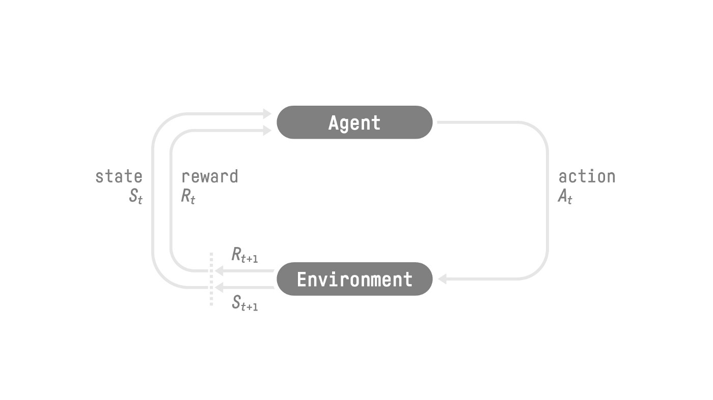
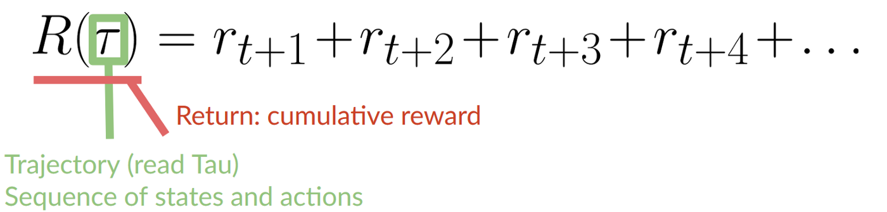
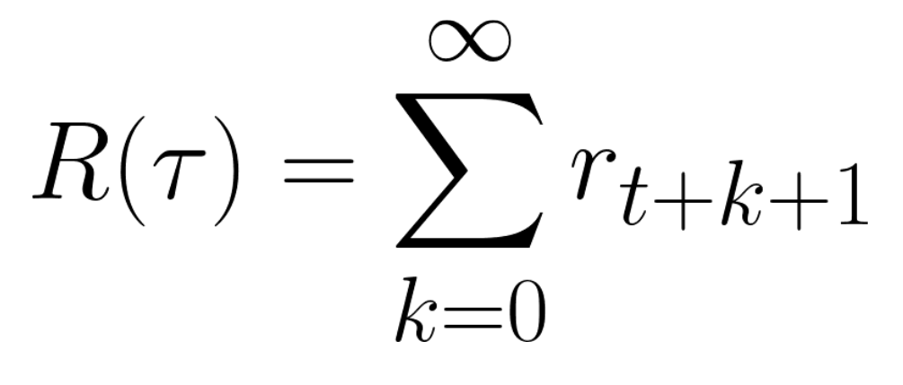
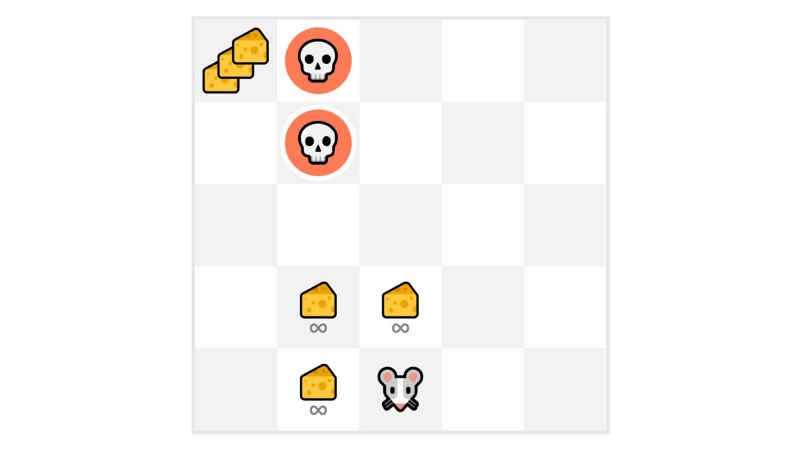

- Deep RL is a type of ML where an agent learns how to behave by performing actions and seeing the results 
- Main idea is that an AI agent will learn from the environment by interacting with it (through trial and error) and receiving rewards (negative or positive) as feedback

#### The RL Framework 

- Agent receives So from the environment (ex, receives first frame of our game)
- Based on So, agent takes action Ao (ex, agent moves to the right)
- Environment goes to new state S1 (ex, new frame)
- Environment gives reward R1 to agent (ex, we're not dead = positive reward +1)

- RL loop outputs a sequence: state -> action -> reward -> next state 
	- Agents goal is to maximize the cumulative reward (ie, the expected return)

**The Reward Hypothesis: Central Idea of RL**
- RL is based on the reward hypothesis 
	- Goal is described as maximization of the expected return 
	- So, to have the best behaviour you must take actions which maximize the expected cumulative reward

**Markov Property**
- Markov Decision Process (MDP)
- In short, Markov Property implies that our agent needs only the current state to decide what action to take and **not** the history of all states and actions prior 

**Observations/States Space**
- Observations/states - the information our agent gets from the environment (ex, frame of a game, value of a certain stock)
- Differentiation between *observation* and *state*: 
	- *State s* -- a **complete description of the state** of the world (no hidden info) in a fully observed environment 
		- ex, in chess game - we have access to the entire board so we receive a state from the environment (ie, fully observed)
	- *Observation o* -- a **partial description of the state**, in a partially observed environment 
		- ex, in Super Mario Bros - only see part of the level close to the player so we receive an observation 

**Action Space**
- Set of all possible actions in an environment - which can come from a *discrete* or *continuous space*
	- Discrete space - the number of possible actions is **finite**
		- ex, super mario bros - have finite set of actions since there's only 4 directions
	- Continuous space - number of possible actions is **infinite**
		- ex, self driving car agent - has infinite number of possible actions since it can turn 20°, 21,1°, 21,2°, honk, turn right 20°, etc. 

**Rewards and the Discounting**
- Reward is fundamental in RL since its the only feedback for the agent 
	- Cumulative reward at each time step *t* can be written as:
	
	which is equivalent to:
	
	- But we can't just add them like that 
	- The rewards that come sooner (at beginning of the game) are more likely to happen since they're more predictable than the long-term future reward

#### Type of Tasks
- Task: an instance of an RL problem. There are two types = episodic and continuing 

**Episodic Task**
- Have a starting point and ending point (terminal state)
- Ultimately creates episodes = list of States, Actions, Rewards and new States 
- ex, super mario bros - an episode begins at the launch of a new level and ends when you're killing/reached the end of the level 

**Continuing Tasks**
- Tasks which continue forever (ie, no terminal state)
- The agent must learn how to choose the best actions and simultaneously interact with the environment 

#### Exploration/Exploitation Trade-Off
- Exploration: exploring the environment by trying random actions in order to find more info about the environment 
- Exploitation: exploiting known information to maximize the reward 
- Note: goal of RL agent is to maximize the expected cumulative reward

**Example**

- Mouse can have an infinite amount of small cheese (+1 each) but at the top at the maze there's a huge sum of cheese (+1000)
	- Exploitation - our agent will never reach the huge sum of cheese but will rather exploit the nearest source of rewards (even if they're smaller)
	- Exploration - if agent does some more exploration, it can discover the bigger reward 
- So, this is the trade off - balancing how much we explore the env and how much we exploit what we already know 
#### 2 Main Approaches for RL Problems
***How do we build an RL agent that can select the actions that maximize its expected cumulative reward?***

**The Policy π: the agent’s brain**
- The Policy π is the agent's brain 
- Its the function which tells us what action to take given the state we're in - ie, defines agent's behaviour at a given time 
- Policy is the function we want to learn and our goal is to find the optimal policy π* - ie, the one which maximizes expected return 
	- We find π* through training 
- 2 approaches to train agent to find optimal policy π*:
	1. Directly: teach the agent to learn which action to take given the current state (**Policy-Based Methods**)
	2. Indirectly: teach the agent to learn which state is more valuable **(Value-Based Methods)** 

**Policy-Based Methods**
- Learn a policy function directly 
- A few possible methods
	- Function can define a mapping from each state to the best corresponding action
	- Could define a probability distribution over the set of possible actions at that state 

- 2 types of policies:
	1. Deterministic: a policy at a given state will always return the same action `a = π(s)`
		- action = policy(state)
		- State So -> π( So) ->  Ao (action is moving to the right)
	2. Stochastic: outputs a probability distribution over actions 
	`π(a | s) = P[A | s]`
	- Policy(actions | state): probability distribution over the set of actions given the state

**Value-Based Methods**
- Learn a value function that maps a state to the expected value of being at that state
	- Value of a state: expected discounted return the agent can get if it starts in that state and then acts according to the chosen policy 
	- `v_π(s) = E_π [ Rₜ₊₁ + γRₜ₊₂ + γ²Rₜ₊₃ + … | Sₜ = s ]`
- With value function - the policy will select the state with the biggest value to attain the goal