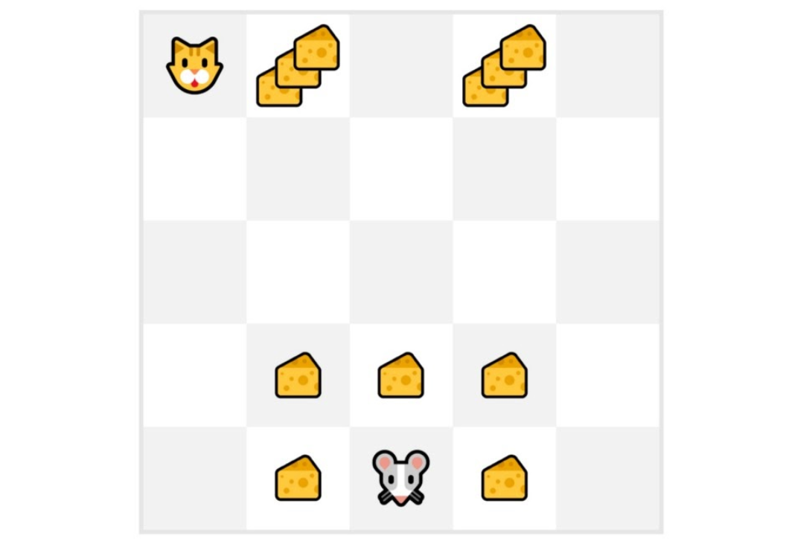
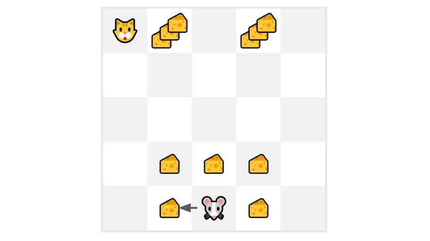

#### 2 Types of Value-Based Methods
*Value-based methods learn a value function which maps a state to the expected value of being in that state. The value of a state is the expected discounted return the agent can get.*

- Value-based rL focuses on learning *how good* each action is -- so, it returns a score for every state (or every state-action pair)
	- So, the optimal policy is derived from these states 
		- ex, if we want a policy which takes actions that'll always lead to the biggest reward - we'll create a Greedy Policy 
	- In the case of value-based method, you never train the policy - the policy is a **simple pre-specified function** which uses values (given by value-function) to select its actions 
- Main difference:
	- Policy-based training: optimal policy (π*) is found by training the policy directly
	- Value-based training: finding optimal value function (Q* or V*) leads to having an optimal policy 
	- Link between value and policy: `π*(s) = arg maxₐ Q*(s, a)`
		- `π∗(s)` = optimal policy at state *s* (ie, action agent should pick if it wants highest long-term reward)
		- `argmax_a`= argument *a* that maximizes the expression
		- `Q∗(s,a)​` = optimal Q-value of (state and action) 
		- In short, look at every possible action you could take in state *s* and check its Q-value (tells you how much total reward you can expect if you take that action) and thus, choose the action with the highest score

**State-value Function**
`V_π(s) = E_π [ G_t | S_t = s ]`
- `V_π(s)`: value of state s
- `E_π`: expected return 
- `S_t = s`: agent starts at state s 

- For each state: the state-value function outputs the expected return **if the agent starts in that state and then follows the policy forever after** 

**Action-value Function**
- Outputs the expected return if the agent starts in that states, **takes that action** and then follows the policy forever after 
- `Q_π(s, a) = E_π [ G_t | S_t = s, A_t = a ]`
- Main difference is:
	- State-value function: calculate value of state `S_t`
	- Action-value function: calculate value of state-action pair (`S_t, A_t`) - hence the value of taking that action at that state

**Bellman Eq'n**
- Regardless of which value function we choose (state-value or action-value function), the returned value = expected return
	- Problem is to calculate each value of state or state-action pair - must **sum** all the rewards an agent can get if it starts at that state (this is computationally expensive)
#### Bellman Equation: Simplify our Value Estimation 
*Simplifies our state value or state-action value calculation*

- To calculate `V (S_t)` (ie, the value of a state) - we must calculate the return starting at that state and then follow policy for forever after 
	-  To calculate `V (S_t)` - must sum the expected rewards 
	-   To calculate `V (S_{t+1})` - must calculate return starting at that state `S_{t+1}`

Example:

- Repeating the computation of different states can be tedious - we can use the Bellman Equation 
- Bellman Equation: a recursive equation where instead of starting for each state from the beginning and calculating the return, we consider the value of any state as:
	- `(The immediate reward R_t+1) + (discounted value of the state which follows (γ∗V(S_{t+1​})**))`
	- => `V(S_t) = R_t+1 + gamma * V(S_{t+1})`

- The Bellman Equation: `V_π(s) = E_π[ R_{t+1} + γ · V_π(S_{t+1}) | S_t = s]`
	- `V_π(s)`: value of state s
	- `E_π`: expected value of immediate reward 
	- `γ · V_π(S_{t+1}`: discounted value of next state 
	- `S_t = s`: if agent starts at state s
- Example: - The value of `V(S_{t+1})` = Immediate reward `R_{t+2}`+ Discounted value of the next state (gamma ∗ `V(S_{t+1})`)

#### Monte Carlo vs. Temporal Difference Learning
*RL agent learns by interacting with its env - given the experience and received reward, the agent should update its value function or policy.*
- Monte Carlo and Temporal Difference are 2 strategies on how to train value/policy functions
	- Monte Carlo uses an entire episode of experience before learning
	- Temporal Difference uses only a step (St,At,Rt+1,St+1St​,At​,Rt+1​,St+1​ ) to learn

**Monte Carlo: learning at the end of the episode**
- Waits until end of episode, calculates the return `G_t` and uses it as a target for updating `V(S_t)`
	- Requires complete episode of interaction before updating value function
$V(S_t) \leftarrow V(S_t) + \alpha \left[G_t - V(S_t)\right]$
- `V(S_t)`: new value of state t 
- `V(S_t)`: (second time and third time) former estimation of value of state t
- `α`: learning rate 
- `G_t`: return at timestep t

Example: 

1. Always start episode at **same starting point**
2. Agent takes actions using policy 
3. Obtain reward and next state
4. Have a terminal state (ex, if cat eats mouse or if mouse moves >10 steps)
5. At the end of the episode - gain the state, actions, rewards and next state tuples 
	- Example: [State tile 3 bottom, Go Left, +1, State tile 2 bottom], [State tile 2 bottom, Go Left, +0, State tile 1 bottom]
6. Agent will sum total rewards to see how well it did (`G_t`)
7. Updates `V(S_t)` based on formula 
8. Start new game with this new knowledge and repeat 
- By running more episodes, the agent will learn to play better 

**Temporal Difference Learning: learning at each step**
*Waits only for one interaction step `S_{t+1}` to form a Temporal Difference (TD) target and update. Main idea is to update the `V(S_t)` at each step.*
- Since we didn't get a whole episode, we don't have `G_t` (expected return) so instead we estimate it by adding `R{t_1}` and the discounted value of next state 
	- Called **bootstrapping** since TD updates on existing new value state of *t* and not complete sample of Gt 

Example:

1. Initialize value function so it returns 0 value for each state 
2. Learning rate (lr) is 0.1 and discount rate is 1 (no discount)
	- Learning rate: α
		- Controls how much the agent updates it estimate value after each step
			- ie, how fast does the agent learn new info
		- 0.1 = mouse updates its *guess* of how *good* a state is by 10% each time (slowly)
	- Discount rate: γ
		- How much does the agent care about future rewards
		- 1 = mouse values future cheese as much as it values immediate cheese (ie, no discount)
			- If 0.9 = would value later cheese a little less than immediate cheese
			- If 0 = would only care about immediate cheese 
3. Mouse begins to explore environment with random action - going to left 
4. Gains rewards and eats cheese 

$V(S_t) \leftarrow V(S_t) + \alpha \left[ R_{t+1} + \gamma V(S_{t+1}) - V(S_t) \right]$
We can now update $V(S_0)$:
New $V(S_0) = V(S_0) + \text{lr} \cdot \left[ R_1 + \gamma \cdot V(S_1) - V(S_0) \right]$
New $V(S_0) = 0 + 0.1 \cdot \left[ 1 + 1 \cdot 0 - 0 \right]$
New $V(S_0) = 0.1$

- Continue to interact with this environment with our updated value function